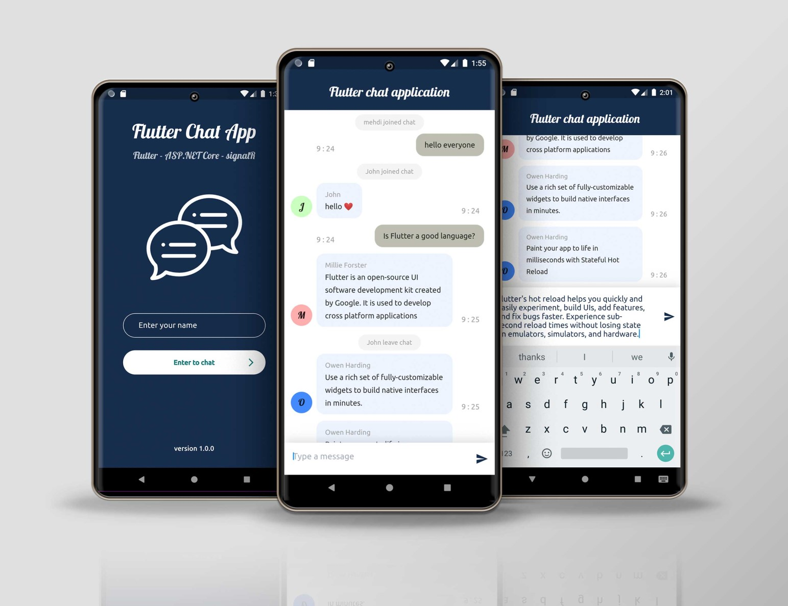
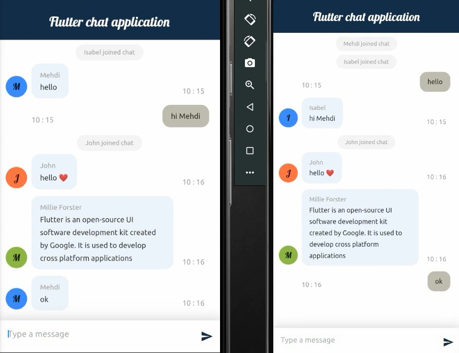
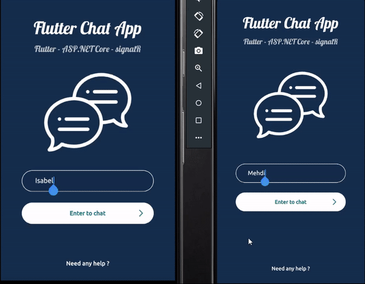

# real time simple chat application with Flutter and SignalR

## :heart: Star the repo to support the project , Thanks :smile:
 
## Description
* client : Flutter
* sever : ASP .NET Core 5.0
* real time : SignalR

## Screenshot 1

## Screenshot 2

## Screen record

## How to run client app
* After clone this repo open lib> pages> chatPage.dart and change this ip `192.168.1.102` to your local network ip
* Run `flutter packages get`
* Run `flutter run` (remember open simulator or connect physical device)

## How to run server app
* After clone this repo open server folder
* Run `dotnet run` (you may need to change the firewall to run on the network)

## Getting Started

For help getting started with Flutter, view our online
[documentation](https://flutter.io/)."# flutter-chat-signalr" 
